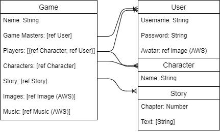

# Aozora
## What is Aozora?
Aozora is a japanese word meaning "Blue Sky". It is a word that evokes the concept of infinite possibility, much like the type of infinite creative possibilities the app intends to facilitate the creation of.
The app itself is a tool for text-based role-playing that allows users to easily add images and music to their stories.
## How it Will Work
Users will be able to login and then once logged in, create or join games. Users can then use a story page to update the story text in an interactive setting with music and images.
### Gamemaster Experience
Creating a game will make the user a gamemaster of the new game. Gamemasters can add more characters, images, and music to the game. Once all of the neccessary files have been uploaded these files can be used on the story page with special commands. Gamemasters can add more players to a game by sending them a game-key.
### Player Experience
Players can join a game with a game-key and then read the story as it is updated, and respond with their character actions.
## Milestones
### MVP
Initial Functionality: Logging in, creating games, and uploading files.  
Secondary Functionality: Adding players and ensuring real-time story updating works.
### Stretch Goals
Additional functionality would involve creating seperate stories for each character so that players can split off from each other.  
More things to include are adding friends and joining games through friends/search rather than a game-key.  
Longer-Term Goals could include using Discord API to connect the story database with chat channels, or implementing low-level rpg mechanics such as die rolling.
## Necessary Technology
I intend to use a MEN stack with JQuery for this application. I also intend to use AWS and Socket.io to facilitate file uploading and real-time updating of the story.
## ERD

